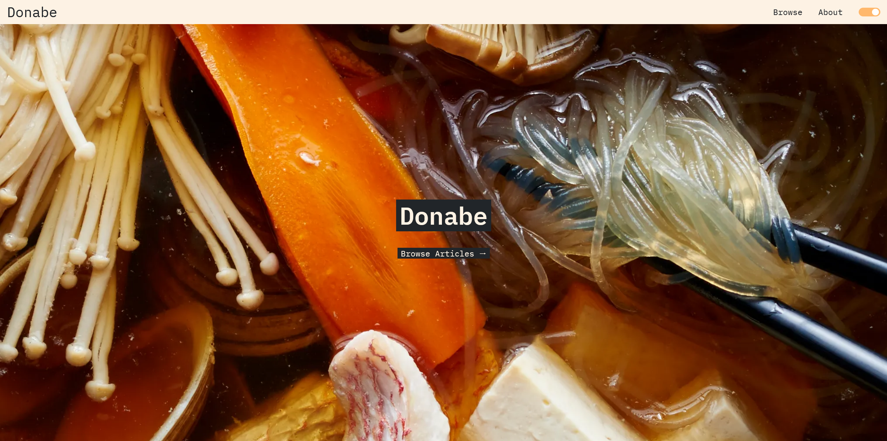
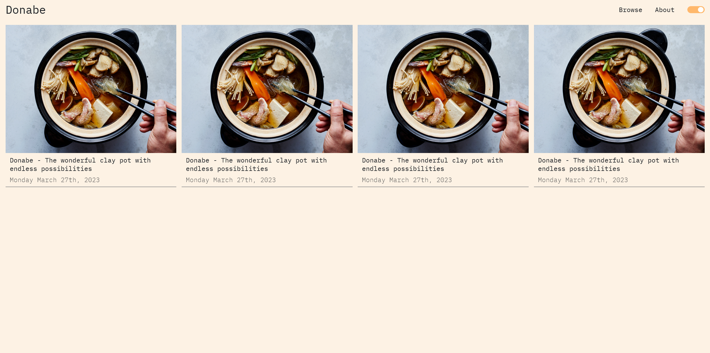
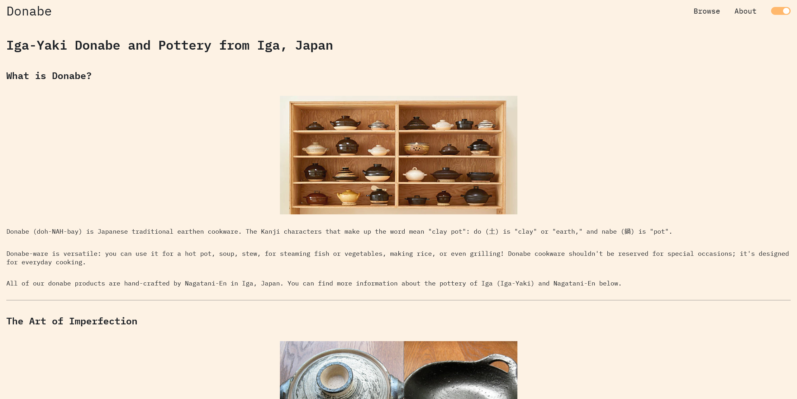
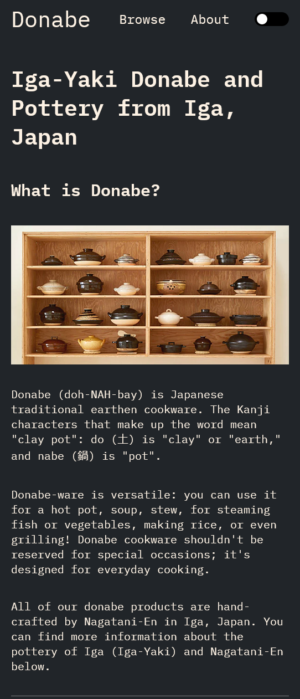

# Donabe

## A bring your own ingredients markdown article viewer

## Why?

After trying and seemingly failing to get some of the basic gatsby starter templates to work (or even install), I decided to take a step back and decide what I was really looking for in them anyway.

As it turns out, I just wanted a lightweight, performant and accessible web application that would act as a reader for articles written in markdown. With this clearer goal in mind I set to work making this.

---

## Installation

```
git clone
cd clonedDirectory/
npm install
```

There are 1 article and an about page (which is what the `/about` route uses) left as examples. Everything should work out of the box.

---

## Building

```
npm run build
npm run preview
```

---

## Architecture

The articles are `.md` files written directly in the respository in the `/public` directory. In order to access them on the `/browse` page there is a mapping in the `articles.ts` file in which you give some metadata about the article that looks like this:

```
{
    _id: 0,
    title: `The wonderful expansive world of Japanese Denim`,
    thumbnail:
      'https://assets.bonappetit.com/photos/57c59f63a184a3c9209db716/4:3/w_4911,h_3683,c_limit/hot-pot-donabe-chopsticks.jpg',
    created: 'Monday March 27th, 2023',
    path: '0.md',
},
```

The `_id` and `path` need to be the same so that the mapping works properly. It doesn't matter what it is, it just needs to be the same `string`.

---

## Technology

This app is a standalone web app with no server. The `.md` files are stored directly in the repository. Even with multiple pictures and tons of markdown, the article files tend to remain under 5kb which feels acceptable.

I tried to keep the libraries to an absolute bare minimum. This uses **no** component libraries and the only styling library it uses is `theme-ui`. It is my preference for styling and theming but anything else could be used as well. The app is viewable on **all** screen sizes (_some extremely esoteric exceptions probably exist_) and I tried to make the app as accessible as possible by using all the correct html tags. _There is still work to be done with better accessibility though_.

All routes are loaded through `@loadable` so you aren't fetching all routes or all articles from everywhere. For instance, if you go straight to an article via the `_id` in the url, then only that single piece of the js bundle will load.

All images used in the `/.md` files are references to outside image hosting services like flickr. I would recommend keeping this convention as it will keep you from saving images locally and bloating the size of your repository.

The `/.md` articles are rendered using `react-markdown`. There is no compilation or build step as the articles are supplied directly to the renderer.

I have done some of my own component mapping for certain html tags rendered by `react-markdown` and these can be found in `componentMapping.ts`. It's small things like making the `h6` tag into a subtitle type tag for images, doing some image width fixing, etc. Feel free to change anything here to your liking.

**Disclaimer** - I did not make this with code rendering in mind, so that will require some setup. As is, it does render single and multiline code blocks, but the styling is very basic and there is no syntax highlighting. I did not need code rendering in general for my own use case so it was left out. If you want to add it yourself, it is fairly simple and you can find out more [from the react-markdown documentation](https://github.com/remarkjs/react-markdown#use-custom-components-syntax-highlight).

---

## Styles

The layout of the `/browse` grid is changeable in `index.css`. This is done to support optional thumbnails in case you want more of a text blog style interface.

All other styles are changeable at will since this is written with vanilla css and `theme-ui`.

You can change the `light` and `dark` theme colors in `theme.ts` and the whole app should reflect the changes.

---

## Images

### Home



### Browse



### Article



### Article Small Screen Size


